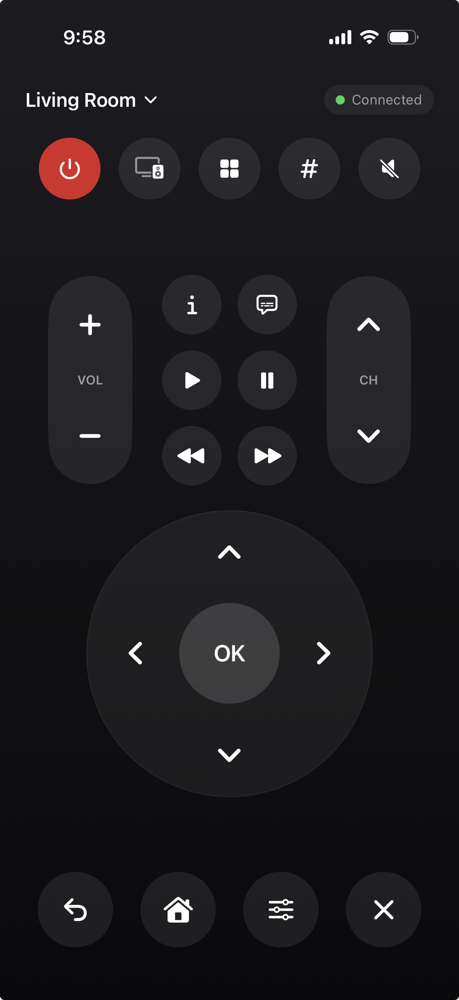

# LG Remote

A clean, ad-free iPhone remote for LG webOS TVs (built for the LG C3, works with any 2014+ webOS TV).

<p align="center">
  
</p>

## Features

- **TV picker on launch** with live power status for every saved TV — tap a TV to wake it and connect. Already connected? You land straight on the remote.
- **Power on that actually works**: Wake-on-LAN plus up to 30 seconds of connection retries, so a TV in deep sleep or Quick Start+ standby really turns on — including waking the panel when webOS answers with the screen off.
- Full remote UI: power, D-pad + OK, back/home/exit, volume & channel rockers, mute, playback controls, number pad, TV settings.
- Input switcher and app launcher populated live from the TV.
- Multiple TVs — add every TV in the house and switch from the menu at the top.
- Automatic discovery on your Wi-Fi via Bonjour (webOS second-screen service, plus LG-filtered AirPlay advertisements), or add by IP address.

## Building

Requires Xcode 16+ (iOS 18 SDK) and [XcodeGen](https://github.com/yonaskolb/XcodeGen) (`brew install xcodegen`).

```sh
xcodegen generate
open LGRemote.xcodeproj
```

Then in Xcode: select the **LGRemote** target → Signing & Capabilities → pick your Team, and build & run on your iPhone. (If your team can't use the `com.benjamin.LGRemote` bundle id, change `bundleIdPrefix` in `project.yml` and run `xcodegen generate` again.)

## TV setup (one time)

1. Make sure the TV is on and on the same Wi-Fi network as your phone.
2. Launch the app — your TV should appear under "Found on your network". Tap it (or add by IP: TV Settings → General → Network).
3. A pairing prompt appears **on the TV** — select Accept. The pairing key is stored, and the TV's MAC address is saved automatically for Wake-on-LAN.

For power-on to work while the TV is off, enable on the TV:

- **Settings → General → Devices → TV Management → Quick Start+** (keeps the network interface alive in standby)
- **Settings → General → Devices → TV Management → Turn On via Wi-Fi** (naming varies slightly by firmware year)

## How it works

- Talks LG's SSAP protocol over a WebSocket to `wss://<tv>:3001` (self-signed cert, trusted only for that direct connection; falls back to `ws://:3000` for old firmware).
- Button presses (arrows, OK, home…) go over the secondary "pointer input" socket the TV hands out.
- Power-on sends Wake-on-LAN magic packets (broadcast + unicast to the TV's last IP), then polls the webOS port until the TV is ready to accept a connection.
- After connecting, the app checks the TV's real power state and sends `turnOnScreen` if the panel is still off (Quick Start+ standby accepts connections with the screen dark).

## Layout

| Path | What's in it |
|---|---|
| `LGRemote/` | SwiftUI app: TV picker, remote UI, setup/discovery, view model |
| `Shared/` | Protocol layer: SSAP WebSocket client, commands, Wake-on-LAN, status probe |
| `project.yml` | XcodeGen project definition (the `.xcodeproj` is generated, not checked in) |

## License

[MIT](LICENSE)
